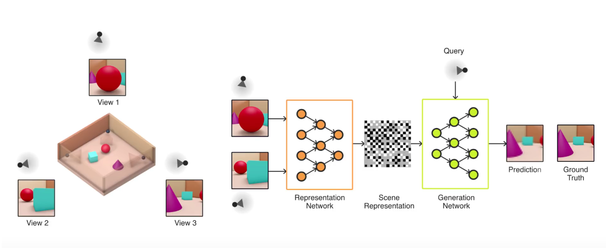
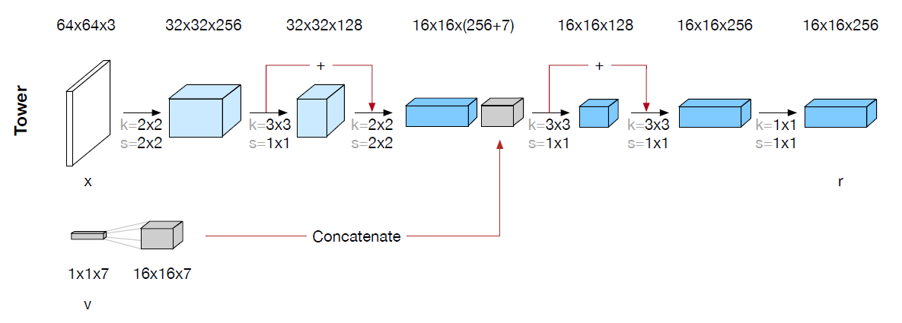
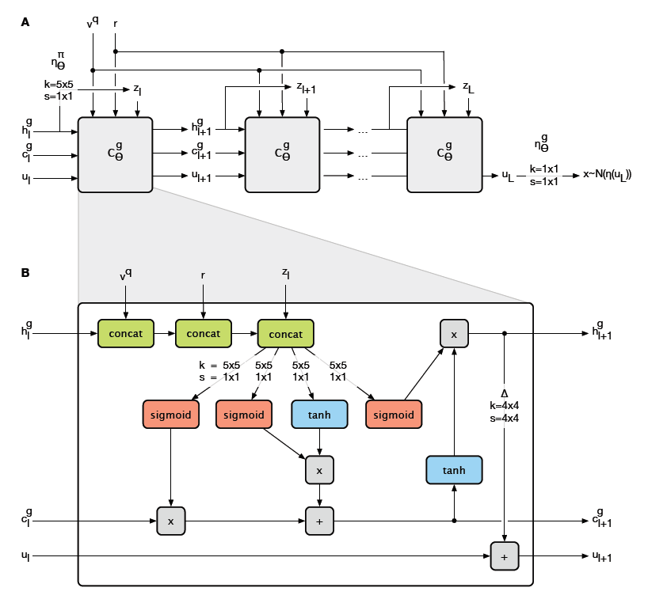

# Neural-Scene-Representation-and-Rendering
Generative Query Network for rendering 3D scenes from 2D images

> There is more than meets the eye when it comes to how we understand a visual scene: our brains draw on prior knowledge to reason and to make inferences that go far beyond the patterns of light that hit our retinas. For example, when entering a room for the first time, you instantly recognise the items it contains and where they are positioned. If you see three legs of a table, you will infer that there is probably a fourth leg with the same shape and colour hidden from view. Even if you can’t see everything in the room, you’ll likely be able to sketch its layout, or imagine what it looks like from another perspective.
    
 [-Deepmind](https://deepmind.com/blog/neural-scene-representation-and-rendering/)   

## Learning to see
Making machines understand the scene is a very challenging task for AI. This is implementation of a neural network which is capable of rendering 3D scenes using just a few 2D images. In general case, it may be impossible to predict arbritary view of the scene from finite set of observations, due to the fact that objects occlude themselves and each 2D observation has finite coverage of 3D scene. To address this issue, DeepMind came up with framework of conditional generative modelling to train powerful stochastic generators. Here is an example demonstrating the algorithm's ability to reconstruct 3D scenes with handful of 2D observations. 

## Generative Query Network
The GQN (Generative Query Network) has 2 neural network models learning together: 
1. Representation Network
2. Generator Network

### Representation Network
#### Architecture

#### Explanation
This is a simple convolutional neural network with skip connections which takes 2D observed images and their viewpoints as input and spits out a representation for the scene. A viewpoint is defined by tuple of (w, y, p) where w is the coordinates of the camera in space, y is the yaw and p is the pitch. Representations are calculated for each 2D image and it's corresponding viewpoint, and the final representation is simply the sum of the representations of all images in the scene. Expressing the representations as sum makes it robust to order in which the observed images are provided as input.

### Generative Network
#### Architecture

#### Explanation
Things get a bit complicated here. The challenge is given a representation from the Representation Network and any arbritary viewpoint, we have to predict the scene. We treat the generator model as a variant of variational autoencoder. The difference is the architecture used. A ConvLSTM layer is used. ConLSTM is an LSTM cell with linear layers replaced by the convolutional layers. So the input, hidden, forget gate all are convolutional layers rather than linear layers. LSTM-ish architecture is used to construct the latent variables sequentially. 
#### Latent Variables
These are the hidden variables which are used to generate images, similar to variational autoencoders.
To sample latent variables we need to have a distribution, which can represent our scenes. The way we form prior distribution is as follow:
1. We have two models, both ConvLSTM, one for inference and another for generation
2. A prior is calculated with no sampling knowledge first using convolutional layer
3. Then using input images, representation and viewpoint, posterior distribution is calculated, again using a convolutional layer
4. We sample our latent variable from posterior distribution and use it to generate image of given viewpoint
5. We calculate KL Divergence between prior distribution and posterior distribution
6. Add KL divergence to reconstruction loss between generated and actual image, to get objective function
7. Minimize the objective function using backpropagation
This ensures that we have prior model which can infer details like shape, color, position and hence generate arbritary scene given any viewpoint and scene representation. As we have priors ready, we can sample even without having representation, i.e no image from scene is provided.
